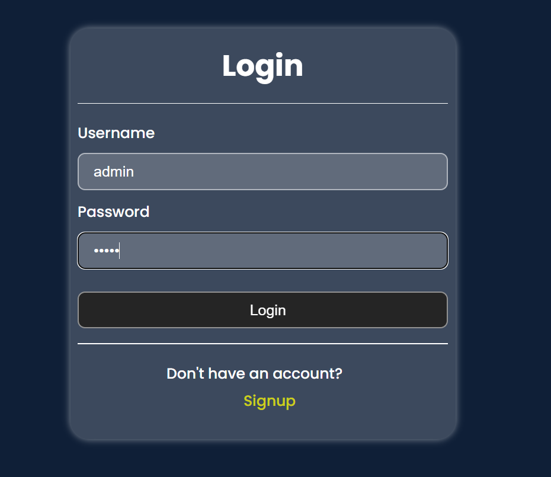
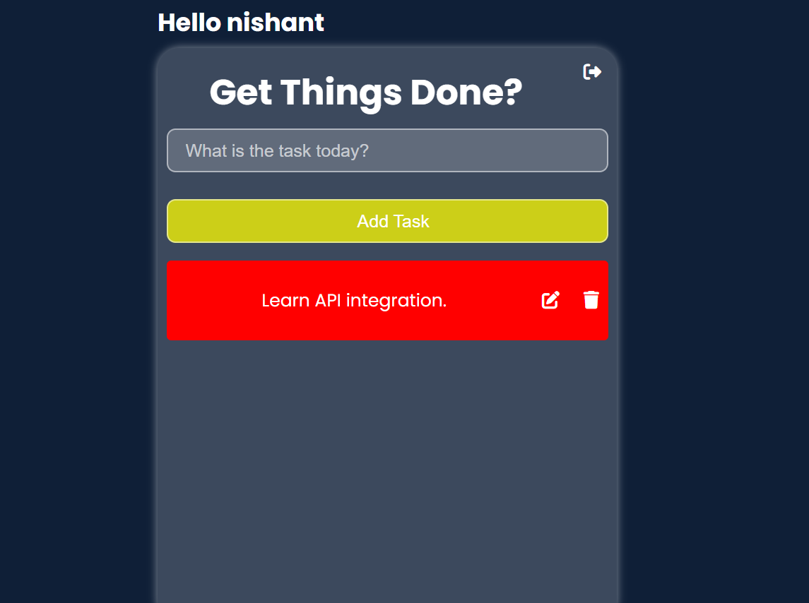

# 📝 Todo App Using Django

[](https://www.python.org/)
[](https://www.djangoproject.com/)
[](LICENSE)
[]()

A modern and efficient To-Do application built with Django, designed to help users manage their daily tasks with ease. This project demonstrates best practices in Django development, including CRUD operations, server-side rendering, and clean architecture.

## ✨ Features

- ✅ Add, update, and delete tasks with ease
- ✅ Mark tasks as completed or pending
- ✅ Modern and responsive user interface
- ✅ Efficient task management system
- ✅ Clean and maintainable codebase
- ✅ Secure authentication system
- ✅ Real-time task updates

## 🛠️ Tech Stack

### Backend
- **Framework**: Django 3.2+
- **Language**: Python 3.8+
- **Database**: SQLite (default)

### Frontend
- HTML5
- CSS3
- JavaScript (ES6+)
- Bootstrap 5

## 🚀 Getting Started

### Prerequisites

- Python 3.8 or higher
- Django 3.2 or higher
- pip (Python package manager)

### Installation

1. **Clone the repository**
   ```bash
   git clone https://github.com/nishant-sth/Todo_app_using_Django.git
   cd Todo_app_using_Django
   ```

2. **Create and activate virtual environment**
   ```bash
   # Windows
   python -m venv venv
   venv\Scripts\activate

   # Linux/Mac
   python3 -m venv venv
   source venv/bin/activate
   ```

3. **Install dependencies**
   ```bash
   pip install -r requirements.txt
   ```

4. **Run migrations**
   ```bash
   python manage.py migrate
   ```

5. **Start the development server**
   ```bash
   python manage.py runserver
   ```

6. **Access the application**
   Open your browser and navigate to `http://127.0.0.1:8000/`

## 📱 Usage

### Adding Tasks
- Click the "Add Task" button
- Fill in the task details
- Submit the form

### Managing Tasks
- Edit: Click the edit button to modify task details
- Delete: Remove tasks using the delete button
- Complete: Mark tasks as complete with a single click

### Task Organization
- View all tasks in a clean, organized list
- Filter tasks by completion status
- Sort tasks by priority or due date

## 📸 Screenshots


*Home Page - Clean and intuitive interface*


*Add Task - Simple task creation form*

## 🤝 Contributing

We welcome contributions! Please follow these steps:

1. Fork the repository
2. Create your feature branch (`git checkout -b feature/amazing-feature`)
3. Commit your changes (`git commit -m 'Add some amazing feature'`)
4. Push to the branch (`git push origin feature/amazing-feature`)
5. Open a Pull Request

## 📝 License

This project is licensed under the MIT License - see the [LICENSE](LICENSE) file for details.

## 📞 Contact

- **GitHub**: [nishant-sth](https://github.com/nishant-sth)
- **Email**: [shresthanis2255@gmail.com]

---

<div align="center">
  <sub>Built with ❤️ by Nishant</sub>
</div>
